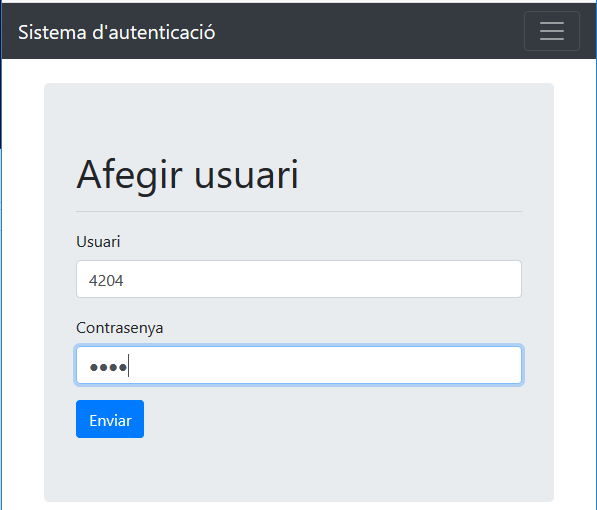
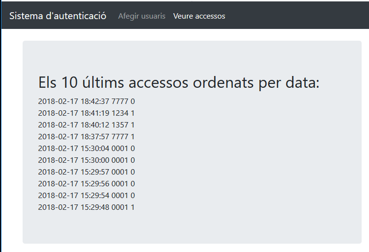
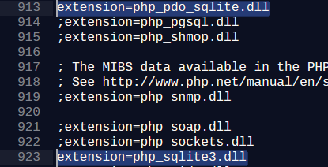

# Rpi3 Access control - UdG Hackday 2 [1st Place]
# [UdG Hackday2 - February 17, 2018 @ 9:00 – 20:00](http://hackday.udg.edu/)
This project was made in less than 12 hours at the UdG Hackday2 hackathon,
we had a raspberry pi 3 and a numpad, we had to make it work <b>without drivers</b>.
We also had to make a website to add users (4 digits for the user, and 4 for the password),
hosting both the databse and website inside the rpi3.
 

## Frontend
One page to add users to the database.
 

 
Another page to check the last 10 login attempts.
 

 
CSS using bootstrap. 
JS using axios - https://github.com/axios/axios <b>pretty cool HTTP client, has concurrency, and easy to use.</b> - for the GET/POST requests.

## Backend
Apache, and PHP to handle the sqlite3 database.

## How does it work
The readKey.py file handles the numpad input so any user can login using the buttons 
(hardest part was making it work with no drivers, GPIO).
Make sure to put the readKey.py somewhere with rwx permissions.
<b>Be sure to enable SQLite3 on the PHP.ini file!</b>
 

